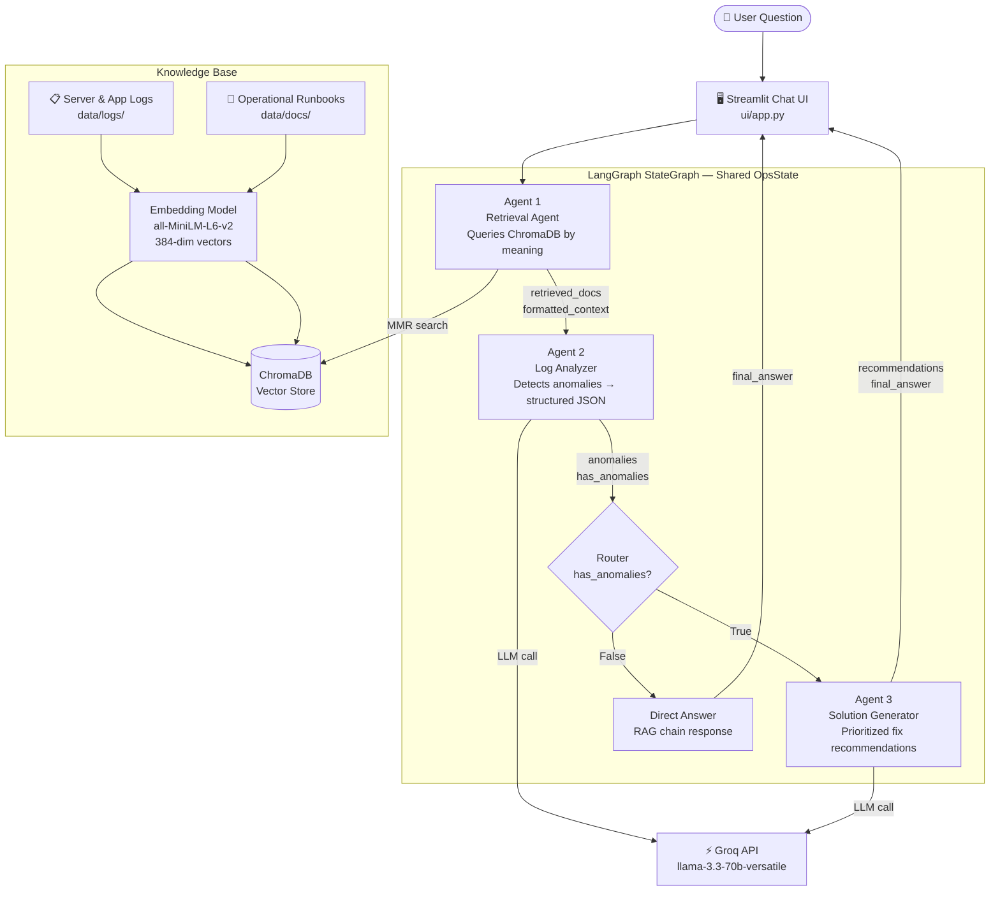

# OpsMind AI

> Multi-agent RAG system for operational intelligence — built with LangGraph, ChromaDB, and Groq.

OpsMind AI is an agentic AI assistant that analyzes system logs and operational runbooks to diagnose infrastructure incidents and generate prioritized fix recommendations. Ask it what went wrong at 3am. It retrieves the relevant evidence, detects anomalies, and tells you exactly what to run.

---

## Architecture



---

## How It Works

**Ingestion (run once):** Log files and runbooks are loaded, split into 600-character overlapping chunks, converted to 384-dimensional vector embeddings using `all-MiniLM-L6-v2`, and stored in ChromaDB. This transforms plain text into a searchable semantic knowledge base.

**Query pipeline (every question):**
1. **Agent 1 — Retrieval:** Embeds the user's question and performs Maximum Marginal Relevance (MMR) search in ChromaDB, returning 5 diverse, relevant chunks with source labels and similarity scores.
2. **Agent 2 — Analyzer:** Sends the retrieved context to the LLM with a structured JSON prompt. Returns typed anomaly objects — `anomaly_type`, `severity`, `service`, `timestamp`, `evidence`, `impact` — not narrative text.
3. **Router:** Reads `has_anomalies` from shared state and conditionally routes to Agent 3 or a direct RAG answer.
4. **Agent 3 — Solution Generator:** Reads the anomaly list and retrieved runbooks to generate prioritized fix recommendations with exact commands. Produces both a machine-readable `recommendations` array and a markdown `final_answer` for the user.

---

## Tech Stack

| Layer | Technology | Purpose |
|---|---|---|
| Agent orchestration | LangGraph | StateGraph with conditional routing |
| LLM | Groq — llama-3.3-70b-versatile | Fast inference, free tier |
| Embeddings | all-MiniLM-L6-v2 | Local CPU, no API key |
| Vector store | ChromaDB | Semantic search with cosine similarity |
| RAG framework | LangChain | Chains, retrievers, prompt templates |
| UI | Streamlit | Chat interface with source panel |
| Containerization | Docker + docker-compose | Portable deployment |
| Testing | pytest | 30+ tests across retriever, agents, pipeline |

---

## Quick Start

### Prerequisites
- Python 3.11+
- A free Groq API key — [console.groq.com](https://console.groq.com/keys)

### 1. Clone and install

```bash
git clone https://github.com/your-username/opsmind-ai.git
cd opsmind-ai

python -m venv venv
source venv/bin/activate  # Windows: venv\Scripts\activate

pip install torch --index-url https://download.pytorch.org/whl/cpu
pip install -r requirements.txt
```

### 2. Configure

```bash
cp .env.example .env
# Add your Groq API key to .env
```

### 3. Build the knowledge base

```bash
python -m ingest.loader
```

This embeds all logs and runbooks into ChromaDB. First run downloads ~90MB embedding model.

### 4. Run the app

```bash
streamlit run ui/app.py
```

Open [http://localhost:8501](http://localhost:8501)

### Docker (alternative)

```bash
docker compose up --build
```

---

## Project Structure

```
opsmind_ai/
├── config.py               # Central config — all settings in one place
├── requirements.txt
├── Dockerfile
├── docker-compose.yml
├── pytest.ini
│
├── data/
│   ├── logs/
│   │   ├── server_logs.txt         # Infrastructure logs with 3 incidents
│   │   └── application_logs.txt    # App-level logs of the same incidents
│   └── docs/
│       ├── runbook_database.md     # DB connection pool fix procedures
│       ├── runbook_nginx.md        # 502/503 diagnosis and resolution
│       └── runbook_memory.md       # JVM memory and disk space procedures
│
├── ingest/
│   ├── loader.py           # Load → chunk → embed → store in ChromaDB
│   └── embeddings.py       # LocalEmbeddings wrapper (sentence-transformers)
│
├── rag/
│   ├── retriever.py        # OpsMindRetriever — MMR search, BaseRetriever
│   └── chain.py            # RAG chain — retriever + prompt + LLM
│
├── agents/
│   ├── retrieval_agent.py  # Agent 1 — ChromaDB search as LangGraph node
│   ├── analyzer_agent.py   # Agent 2 — anomaly detection, structured JSON
│   └── solution_agent.py   # Agent 3 — fix recommendations + final answer
│
├── graph/
│   ├── state.py            # OpsState TypedDict — shared agent whiteboard
│   └── pipeline.py         # StateGraph — wires agents with conditional routing
│
├── ui/
│   └── app.py              # Streamlit chat UI with source + anomaly panels
│
└── tests/
    ├── conftest.py
    ├── test_retriever.py   # 14 fast tests — no LLM calls
    ├── test_agents.py      # Individual agent tests
    └── test_pipeline.py    # End-to-end pipeline tests
```

---

## Running Tests

```bash
# Fast tests only — no LLM calls (~15 seconds)
pytest tests/test_retriever.py -v

# All tests
pytest tests/ -v
```

---

## Example Questions

```
What happened with the database at 3:42 AM and how do I fix it?
Are there any JVM memory or GC pressure issues in the logs?
Why are we getting 502 errors from nginx?
The disk on /var is critically full — what do I do right now?
What anomalies occurred overnight?
```

---

## Key Design Decisions

**Why MMR over similarity search?** Maximum Marginal Relevance retrieves diverse chunks rather than the five most similar (which are often near-duplicates). This ensures each retrieved chunk adds new information to the LLM's context.

**Why structured JSON output from Agent 2?** Returning typed anomaly objects (`severity`, `anomaly_type`, `evidence`) instead of narrative text makes Agent 3's job composable — it can iterate over anomalies programmatically, sort by severity, and generate targeted recommendations per anomaly.

**Why a shared TypedDict state?** Agents don't call each other directly — they all read from and write to `OpsState`. This makes each agent independently testable and lets LangGraph manage the execution order and routing.

**Why separate agents instead of one big prompt?** A single prompt doing retrieval + analysis + recommendations produces mediocre results at all three. Focused agents with narrow prompts produce significantly better output at each stage.